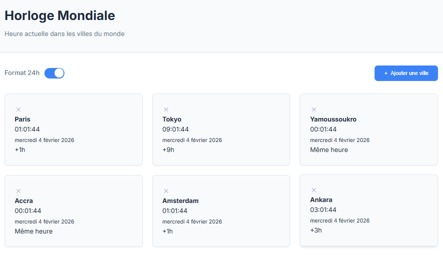

# World_clock

Horloge mondiale permettant d’afficher l’heure en temps réel dans plusieurs villes du monde.

Projet réalisé dans le cadre de mon challenge **100 projets en 2026**. **Projet n°13**

---

## Objectif

- Travailler la gestion des **fuseaux horaires**
- Manipuler les objets `Date` et `Intl`
- Mettre en place une logique **temps réel**
- Améliorer l’UX avec ajout/suppression dynamique
- Utiliser une **API externe**

---

## Technologies

- HTML  
- CSS  
- JavaScript (Vanilla)
- API REST Countries
- LocalStorage

---

## Fonctionnalités

- Affichage de l’heure en temps réel
- Ajout et suppression de villes
- Recherche par ville ou pays
- Format 12h / 24h
- Calcul du décalage horaire
- Sauvegarde des villes sélectionnées

---

## Concepts abordés

- Programmation orientée objet (classe)
- Timers (`setInterval`)
- Manipulation des dates et fuseaux horaires
- Gestion du DOM
- Stockage local
- Gestion d’erreurs (fallback fuseaux horaires)

---

## Lancer le projet

- Ouvrir `index.html` dans un navigateur
- Aucun backend, aucune installation

---

## Captures d’écran

---
## Statut
 **Projet terminé**  